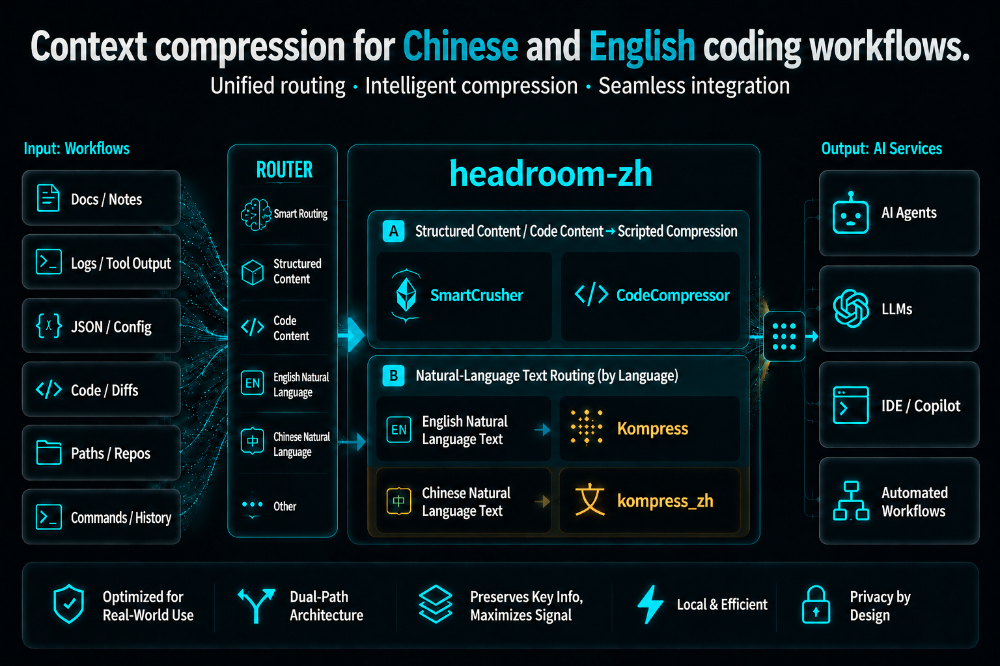

<p align="center">
  <a href="README.zh-CN.md">简体中文</a> · <strong>English</strong>
</p>

<p align="center">
  
</p>

<p align="center"><strong>Bring Headroom to real Chinese coding workflows with a dedicated Chinese compression lane.</strong></p>

<p align="center"><strong>Verified on a real docs-review agent workload: one recorded Chinese payload shrank from 14,342 bytes to 4,200 bytes while preserving the anchors the agent still needed.</strong></p>

<p align="center">
  <a href="https://github.com/Hust-wahaha/headroom-zh"></a>
  <a href="docs/HEADROOM_ZH_STATUS_2026-06-20.md"></a>
  <a href="https://huggingface.co/chopratejas/kompress-v2-base"></a>
  <a href="https://huggingface.co/Deserveall/kompress_zh-baseline-v1-lora"></a>
  <a href="LICENSE"></a>
  <a href="docs/HEADROOM_ZH_AUTODL_DEMO_RUNBOOK.md"></a>
</p>

<p align="center">
  <a href="#why-headroom-zh-exists">Why</a> ·
  <a href="#what-makes-headroom-zh-different">What is unique</a> ·
  <a href="#where-it-is-meant-to-win">Use Cases</a> ·
  <a href="#headroom-zh-demo-status">Demo Status</a> ·
  <a href="#get-started-60-seconds">Install</a> ·
  <a href="#upstream-foundation">Foundation</a> ·
  <a href="#agent-compatibility-matrix">Agents</a> ·
  <a href="https://huggingface.co/Deserveall/kompress_zh-baseline-v1-lora">Model</a> ·
  <a href="https://headroom-docs.vercel.app/docs">Upstream Docs</a>
</p>

<p align="center"><sub>
  <b>AI agents / LLMs:</b> read <a href="llms.txt"><code>/llms.txt</code></a> here, or fetch <a href="https://headroom-docs.vercel.app/llms.txt">the live index</a> / <a href="https://headroom-docs.vercel.app/llms-full.txt">full docs blob</a>.
</sub></p>

---

| What it changes | Why it matters |
|---|---|
| **Adds `kompress_zh` without removing upstream `Kompress`** | English/plain-text traffic keeps the original lane; Chinese-heavy traffic finally gets a lane built for it. |
| **Optimized for code-agent context, not pretty summaries** | Compresses docs, logs, handoff notes, tool outputs, and source bundles into forms that Claude/Codex/GPT can still act on. |
| **Anchor-aware by design** | Paths, URLs, commands, identifiers, risks, and next steps are treated as first-class signals instead of disposable wording. |

## Why headroom-zh exists

Upstream `headroom` is already a powerful context-compression system. But for
Chinese-heavy projects, one missing piece matters a lot: without a strong
Chinese plain-text compressor, a large part of real Chinese tool outputs,
handoff docs, logs, and repo context still cannot enjoy the full Headroom
effect.

`headroom-zh` exists to close exactly that gap.

It keeps the upstream `Kompress` path for English and general plain-text
workloads, and adds `kompress_zh` for Chinese-dominant prose. That turns
Headroom from "great in principle" into something Chinese coders can actually
use on real projects. The result is simple and important: many more Chinese
developers can finally experience Headroom's token savings in their own daily
coding workflows, without giving up anchors, structure, or agent usefulness.

In short: `headroom-zh` is the layer that makes Headroom genuinely usable for
Chinese project contexts.

## What makes headroom-zh different

- **Dual-lane prose compression**: keep upstream `Kompress` for English and
  general plain text, but route Chinese-dominant prose to `kompress_zh`.
- **Chinese-agent-oriented output style**: compressed text is tuned for LLM
  readers, often using light structure and concise Chinese shorthand rather
  than human-facing polished prose.
- **Anchor-aware by design**: the data and review flow intentionally mix paths,
  URLs, identifiers, commands, risks, next steps, and other "do not drop"
  spans that code-agent workflows depend on.

## Where it is meant to win

- **Chinese repo handoff and project-state reading**: long `CURRENT_STATE`,
  `AGENT_HANDOFF`, planning, and execution docs that an agent must read before
  acting.
- **Logs and failure triage**: mixed Chinese explanations with stack traces,
  commands, paths, and environment details.
- **Codebase exploration bundles**: source summaries, file digests, repo notes,
  and RAG chunks prepared for Codex, Claude Code, or similar agents.
- **Mixed-language reality**: Chinese prose can coexist with English symbols,
  paths, URLs, JSON fragments, and code identifiers without forcing the whole
  request onto an English-only compression path.

## Representative case

The clearest homepage case is `case_01_docs_review`: a long Chinese project
handoff bundle that mixes prose with model IDs, file paths, ports, scripts, and
execution constraints.

**Task shape**

The agent is asked to read the bundle first, then report:

1. current project goal
2. completed work
3. next three priority steps
4. risks and dependencies

**Before: raw handoff fragment**

```md
目前最大的展示短板不是代理或模型本身，而是缺少高质量中文 demo 工作负载。
如果从零给 agent 扔一个很短的空任务，它几乎不需要读任何东西，Headroom 的优势就看不出来。

推荐执行顺序：
1. 在 AutoDL 上启动 `scripts/smoke_autodl_headroom.py --keep-running`
2. 保持代理运行在 `8790`
3. 把 CodeX 或 Claude Code 指向代理
4. 让 agent 先读取大体量中文材料，再回答问题或执行探索
5. 截图 `/dashboard`
6. 导出或截图 `/stats-history`

风险与依赖：
- 依赖远端 AutoDL 网络与模型缓存
- 演示时如果任务太短，节省数字会弱
- 纯英文任务可能更多落到原生 `kompress`
```

**After: representative compressed form**

This is an illustrative agent-facing compressed form for the same bundle style.
It is shown to make the retention target obvious, not to claim a byte-exact
verbatim model output.

```md
问题: 若任务过短, agent 无需读长中文材料, Headroom 优势不显。

执行顺序:
1. AutoDL 起 `scripts/smoke_autodl_headroom.py --keep-running`
2. 代理端口固定 `8790`
3. CodeX / Claude Code 指向代理
4. 先读长中文材料, 后回答/探索
5. 展示 `/dashboard` 与 `/stats-history`

风险:
- 依赖 AutoDL 网络与模型缓存
- 短任务节省数字弱
- 纯英文任务可能走原生 `kompress`
```

**What remains actionable after compression**

- the core decision logic is still explicit
- the execution order is still explicit
- the key command, port, and dashboard endpoints are still explicit
- the agent can still answer what to do next and what could go wrong

**Why this is a good `headroom-zh` case**

- It is long enough that compression actually matters.
- It contains anchors the agent cannot afford to lose.
- It looks like a real Chinese code-agent reading task, not a benchmark toy.

**Recorded result**

- recorded payload envelope: `14,342 bytes → 4,200 bytes`
- the same recorded call also reported router-side `saved=3442` on the
  attempted compressed unit
- the same bundle family produced visible `/dashboard` and `/stats-history`
  growth during the verified AutoDL Codex demo

This is the kind of workload `headroom-zh` is built for: not generic chat, but
long Chinese context that still has to remain actionable after compression.

<p align="center">
  
  <br/><sub>Recorded docs-review run: compression visible in the dashboard, with paths, ports, scripts, execution order, and risk signals still preserved for the agent.</sub>
</p>

## What it does

- **Library** — `compress(messages)` in Python or TypeScript, inline in any app
- **Proxy** — `headroom proxy --port 8787`, zero code changes, any language
- **Agent wrap** — `headroom wrap claude|codex|cursor|aider|copilot` in one command
- **MCP server** — `headroom_compress`, `headroom_retrieve`, `headroom_stats` for any MCP client
- **Cross-agent memory** — shared store across Claude, Codex, Gemini, auto-dedup
- **`headroom learn`** — mines failed sessions, writes corrections to `CLAUDE.md` / `AGENTS.md`
- **Reversible (CCR)** — originals are cached for retrieval on demand

## How it works (30 seconds)

```
 Your agent / app
   (Claude Code, Cursor, Codex, LangChain, Agno, Strands, your own code…)
        │   prompts · tool outputs · logs · RAG results · files
        ▼
    ┌────────────────────────────────────────────────────┐
    │  Headroom   (runs locally — your data stays here)  │
    │  ────────────────────────────────────────────────  │
    │  CacheAligner  →  ContentRouter  →  CCR            │
    │                    ├─ SmartCrusher   (JSON)        │
    │                    ├─ CodeCompressor (AST)         │
    │                    └─ Kompress / kompress_zh       │
    │                                                    │
    │  Cross-agent memory  ·  headroom learn  ·  MCP     │
    └────────────────────────────────────────────────────┘
        │   compressed prompt  +  retrieval tool
        ▼
 LLM provider  (Anthropic · OpenAI · Bedrock · …)
```

- **ContentRouter** — detects content type, selects the right compressor
- **SmartCrusher / CodeCompressor / Kompress / kompress_zh** — compress JSON, AST, or prose
- **CacheAligner** — stabilizes prefixes so provider KV caches actually hit
- **CCR** — stores originals locally; LLM calls `headroom_retrieve` if it needs them

→ [Architecture](https://headroom-docs.vercel.app/docs/architecture) · [CCR reversible compression](https://headroom-docs.vercel.app/docs/ccr) · [Kompress-v2-base](https://huggingface.co/chopratejas/kompress-v2-base) · [kompress_zh baseline model card](https://huggingface.co/Deserveall/kompress_zh-baseline-v1-lora)

## Get started (60 seconds)

`headroom-zh` is currently a source-first fork: use upstream `headroom` package
artifacts for the baseline runtime, or install this repository from source to
reproduce the verified Chinese-first demo path.

```bash
# 1 — Install a baseline runtime
pip install "headroom-ai[all]"          # upstream Python package
npm install headroom-ai                 # upstream Node / TypeScript package

# 2 — Or run the verified fork directly
git clone https://github.com/Hust-wahaha/headroom-zh.git
cd headroom-zh
pip install -e ".[dev]"

# 3 — Pick your mode
headroom wrap claude                    # wrap a coding agent
headroom proxy --port 8787              # drop-in proxy, zero code changes
# or: from headroom import compress      # inline library

# 4 — See the savings
headroom perf
```

Granular extras: `[proxy]`, `[mcp]`, `[ml]`, `[code]`, `[memory]`, `[relevance]`, `[image]`, `[agno]`, `[langchain]`, `[evals]`. Requires **Python 3.10+**.

## Upstream foundation

The original `headroom` project already established the broader context
compression foundation that `headroom-zh` builds on.

Representative upstream results:

| Workload                      | Before | After  | Savings |
|-------------------------------|-------:|-------:|--------:|
| Code search (100 results)     | 17,765 |  1,408 | **92%** |
| SRE incident debugging        | 65,694 |  5,118 | **92%** |
| GitHub issue triage           | 54,174 | 14,761 | **73%** |
| Codebase exploration          | 78,502 | 41,254 | **47%** |

**Accuracy preserved on standard benchmarks:**

| Benchmark  | Category | N   | Baseline | Headroom | Delta      |
|------------|----------|----:|---------:|---------:|------------|
| GSM8K      | Math     | 100 |    0.870 |    0.870 | **±0.000** |
| TruthfulQA | Factual  | 100 |    0.530 |    0.560 | **+0.030** |
| SQuAD v2   | QA       | 100 |        — |  **97%** | 19% compression |
| BFCL       | Tools    | 100 |        — |  **97%** | 32% compression |

See the upstream methodology here:
`python -m headroom.evals suite --tier 1` · [Full benchmarks & methodology](https://headroom-docs.vercel.app/docs/benchmarks)

## Headroom ZH demo status

This fork also carries a Chinese-first `kompress_zh` demo stack for long
document, log, and codebase-reading workloads.

Current verified path:

- `Codex CLI`
- local Headroom proxy
- OpenAI-compatible `/v1/responses` path
- browser-open `/dashboard` + `/stats-history`
- Chinese heavy context flowing through `/v1/responses`

Latest verified docs:

- [`docs/HEADROOM_ZH_STATUS_2026-06-20.md`](docs/HEADROOM_ZH_STATUS_2026-06-20.md)
- [`docs/HEADROOM_ZH_AUTODL_DEMO_RUNBOOK.md`](docs/HEADROOM_ZH_AUTODL_DEMO_RUNBOOK.md)
- [`demo_assets/headroom_zh_agent_cases/`](demo_assets/headroom_zh_agent_cases/)

## Agent compatibility matrix

| Agent       | `headroom wrap` | Notes                            |
|-------------|:---------------:|----------------------------------|
| Claude Code | ✅              | `--memory` · `--code-graph`      |
| Codex       | ✅              | shares memory with Claude        |
| Cursor      | ✅              | prints config — paste once       |
| Aider       | ✅              | starts proxy + launches          |
| Copilot CLI | ✅              | starts proxy + launches          |
| OpenClaw    | ✅              | installs as ContextEngine plugin |

Any OpenAI-compatible client works via `headroom proxy`. MCP-native: `headroom mcp install`.

### GitHub Copilot CLI subscription mode

Headroom can route GitHub Copilot CLI subscription traffic through the local proxy:

```bash
headroom wrap copilot --subscription -- --model gpt-4o
```

This lets Headroom intercept OpenAI-compatible Copilot CLI requests and apply the same proxy compression pipeline before forwarding to GitHub Copilot's hosted API. The wrapper resolves the account-specific Copilot API endpoint and prints it as `COPILOT_PROVIDER_API_URL=...` during launch.

Platform support note: macOS auth reuse via Copilot CLI Keychain storage has been smoke-tested. Windows Credential Manager, Linux Secret Service / `secret-tool`, and Docker/CI token-injection paths are implemented or planned as auth-discovery paths, but still need real OS validation before they should be considered fully vetted. For Docker and CI, prefer passing an explicit `GITHUB_COPILOT_TOKEN` or `GITHUB_COPILOT_GITHUB_TOKEN` rather than relying on host keychain access.

## When to use · When to skip

**Great fit if you…**
- run AI coding agents daily and want savings without changing your code
- work across multiple agents and want shared memory
- need reversible compression — originals are retrievable via CCR within the configured TTL

**Skip it if you…**
- only use a single provider's native compaction and don't need cross-agent memory
- work in a sandboxed environment where local processes can't run

<details>
<summary><b>Integrations — drop Headroom into any stack</b></summary>

| Your setup             | Hook in with                                                     |
|------------------------|------------------------------------------------------------------|
| Any Python app         | `compress(messages, model=…)`                                    |
| Any TypeScript app     | `await compress(messages, { model })`                            |
| Anthropic / OpenAI SDK | `withHeadroom(new Anthropic())` · `withHeadroom(new OpenAI())`   |
| Vercel AI SDK          | `wrapLanguageModel({ model, middleware: headroomMiddleware() })` |
| LiteLLM                | `litellm.callbacks = [HeadroomCallback()]`                       |
| LangChain              | `HeadroomChatModel(your_llm)`                                    |
| Agno                   | `HeadroomAgnoModel(your_model)`                                  |
| Strands                | [Strands guide](https://headroom-docs.vercel.app/docs/strands)  |
| ASGI apps              | `app.add_middleware(CompressionMiddleware)`                      |
| Multi-agent            | `SharedContext().put / .get`                                     |
| MCP clients            | `headroom mcp install`                                           |

</details>

<details>
<summary><b>What's inside</b></summary>

- **SmartCrusher** — universal JSON: arrays of dicts, nested objects, mixed types.
- **CodeCompressor** — AST-aware for Python, JS, Go, Rust, Java, C++.
- **Kompress-base** — our default English/plain-text compression model for agent traces.
- **kompress_zh** — an additional Chinese plain-text compressor, routed only for Chinese-dominant prose.
- **Image compression** — 40–90% reduction via trained ML router.
- **CacheAligner** — stabilizes prefixes so Anthropic/OpenAI KV caches actually hit.
- **IntelligentContext** — score-based context fitting with learned importance.
- **CCR** — reversible compression; LLM retrieves originals on demand.
- **Cross-agent memory** — shared store, agent provenance, auto-dedup.
- **SharedContext** — compressed context passing across multi-agent workflows.
- **`headroom learn`** — plugin-based failure mining for Claude, Codex, Gemini.

</details>

<details>
<summary><b>Pipeline internals</b></summary>

Headroom exposes one stable request lifecycle across `compress()`, the SDK, and the proxy:

`Setup` → `Pre-Start` → `Post-Start` → `Input Received` → `Input Cached` → `Input Routed` → `Input Compressed` → `Input Remembered` → `Pre-Send` → `Post-Send` → `Response Received`

- **Transforms** do the work: CacheAligner, ContentRouter, SmartCrusher, CodeCompressor, Kompress, kompress_zh, IntelligentContext / RollingWindow.
- **Pipeline extensions** observe or customize lifecycle stages via `on_pipeline_event(...)`.
- **Compression hooks** sit alongside the canonical lifecycle as an additional extension seam.
- **Proxy extensions** remain the server/app integration seam for ASGI middleware, routes, and startup policy.

Provider and tool-specific behavior lives under `headroom/providers/` so core orchestration stays focused on lifecycle, sequencing, and policy.

- **CLI/tool slices**: `headroom/providers/claude`, `copilot`, `codex`, `openclaw`
- **Provider runtime slices**: `headroom/providers/claude`, `gemini`, plus shared backend/runtime dispatch in `headroom/providers/registry.py`
- **Core files stay orchestration-first**: `wrap.py`, `client.py`, `cli/proxy.py`, and `proxy/server.py` delegate provider-specific env shaping, API target normalization, backend selection, and transport dispatch.

</details>

## Install

```bash
pip install "headroom-ai[all]"          # upstream Python package
npm install headroom-ai                 # upstream TypeScript / Node package
docker pull ghcr.io/chopratejas/headroom:latest   # upstream base image
```

Granular extras: `[proxy]`, `[mcp]`, `[ml]` (Kompress + kompress_zh), `[code]`, `[memory]`, `[relevance]`, `[image]`, `[agno]`, `[langchain]`, `[evals]`. Requires **Python 3.10+**.

For the verified `headroom-zh` route shown in this repository, prefer source
install from `Hust-wahaha/headroom-zh`.

Using `pipx`? Choose a supported interpreter explicitly:

```bash
pipx install --python python3.13 "headroom-ai[all]"
```

→ [Installation guide](https://headroom-docs.vercel.app/docs/installation) — Docker tags, persistent service, PowerShell, devcontainers.

## headroom learn

<p align="center">
  
</p>

`headroom learn` — mines failed sessions, writes corrections to `CLAUDE.md` / `AGENTS.md` / `GEMINI.md`.

## Documentation

| Start here                                                                    | Go deeper                                                                          |
|-------------------------------------------------------------------------------|------------------------------------------------------------------------------------|
| [Quickstart](https://headroom-docs.vercel.app/docs/quickstart)                | [Architecture](https://headroom-docs.vercel.app/docs/architecture)                 |
| [Proxy](https://headroom-docs.vercel.app/docs/proxy)                          | [How compression works](https://headroom-docs.vercel.app/docs/how-compression-works) |
| [MCP tools](https://headroom-docs.vercel.app/docs/mcp)                        | [CCR — reversible compression](https://headroom-docs.vercel.app/docs/ccr)          |
| [Memory](https://headroom-docs.vercel.app/docs/memory)                        | [Cache optimization](https://headroom-docs.vercel.app/docs/cache-optimization)     |
| [Failure learning](https://headroom-docs.vercel.app/docs/failure-learning)    | [Benchmarks](https://headroom-docs.vercel.app/docs/benchmarks)                    |
| [Configuration](https://headroom-docs.vercel.app/docs/configuration)          | [Limitations](https://headroom-docs.vercel.app/docs/limitations)                  |

## Compared to

Headroom runs **locally**, covers **every** content type, works with every major framework, and is **reversible**.

|                                                                              | Scope                                          | Deploy                             | Local | Reversible |
|------------------------------------------------------------------------------|------------------------------------------------|------------------------------------|:-----:|:----------:|
| **Headroom**                                                                 | All context — tools, RAG, logs, files, history | Proxy · library · middleware · MCP | Yes   | Yes        |
| [RTK](https://github.com/rtk-ai/rtk)                                        | CLI command outputs                            | CLI wrapper                        | Yes   | No         |
| [lean-ctx](https://github.com/yvgude/lean-ctx)                               | CLI commands, MCP tools, editor rules          | CLI wrapper · MCP                  | Yes   | No         |
| [Compresr](https://compresr.ai), [Token Co.](https://thetokencompany.ai)    | Text sent to their API                         | Hosted API call                    | No    | No         |
| OpenAI Compaction                                                            | Conversation history                           | Provider-native                    | No    | No         |

> **Attribution.** Headroom ships with the excellent [RTK](https://github.com/rtk-ai/rtk) binary for shell-output rewriting — `git show --short`, scoped `ls`, summarized installers. Huge thanks to the RTK team; their tool is a first-class part of our stack, and Headroom compresses everything downstream of it. Headroom can also use [lean-ctx](https://github.com/yvgude/lean-ctx) as the selected CLI context tool; set `HEADROOM_CONTEXT_TOOL=lean-ctx` before running `headroom wrap ...`.

## Contributing

```bash
git clone https://github.com/Hust-wahaha/headroom-zh.git && cd headroom-zh
pip install -e ".[dev]" && pytest
```

Devcontainers in `.devcontainer/` (default + `memory-stack` with Qdrant & Neo4j). See [CONTRIBUTING.md](CONTRIBUTING.md).

## Community

- **[headroom-zh repository](https://github.com/Hust-wahaha/headroom-zh)** — the fork that adds the Chinese-first compressor lane and demo path.
- **[Upstream Headroom docs](https://headroom-docs.vercel.app/docs)** — core architecture, proxy, MCP, and benchmark documentation.
- **[Kompress-v2-base on HuggingFace](https://huggingface.co/chopratejas/kompress-v2-base)** — the default English/plain-text compression model.
- **[kompress_zh-baseline-v1-lora on HuggingFace](https://huggingface.co/Deserveall/kompress_zh-baseline-v1-lora)** — the Chinese plain-text compression branch.

## License

Apache 2.0 — see [LICENSE](LICENSE).
