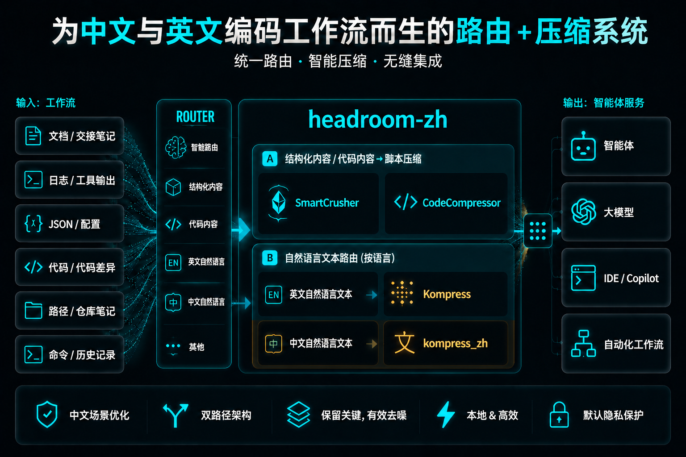

<p align="center">
  <strong>简体中文</strong> · <a href="README.md">English</a>
</p>

<p align="center">
  
</p>

<p align="center"><strong>把 Headroom 真正带进中英文编码工作流：保留上游能力，同时补齐中文压缩链路。</strong></p>

<p align="center"><strong>已在真实中文 docs-review agent 工作负载上验证：一段录制请求从 14,342 bytes 压到 4,200 bytes，同时保留后续智能体仍需读取的关键锚点。</strong></p>

<p align="center">
  <a href="https://github.com/Hust-wahaha/headroom-zh"></a>
  <a href="docs/HEADROOM_ZH_STATUS_2026-06-20.md"></a>
  <a href="https://huggingface.co/chopratejas/kompress-v2-base"></a>
  <a href="https://huggingface.co/Deserveall/kompress_zh-baseline-v1-lora"></a>
  <a href="LICENSE"></a>
  <a href="docs/HEADROOM_ZH_AUTODL_DEMO_RUNBOOK.md"></a>
</p>

<p align="center">
  <a href="#为什么需要-headroom-zh">为什么存在</a> ·
  <a href="#它与上游-headroom-的关系">与上游关系</a> ·
  <a href="#它真正补上的是什么">独特价值</a> ·
  <a href="#代表性-case">代表性 Case</a> ·
  <a href="#已验证-demo-状态">Demo 状态</a> ·
  <a href="#60-秒开始">快速开始</a> ·
  <a href="#agent-兼容性">Agent 兼容性</a>
</p>

<p align="center"><sub>
  <b>AI agents / LLMs：</b>可读取本仓库 <a href="llms.txt"><code>/llms.txt</code></a>，或访问<a href="https://headroom-docs.vercel.app/llms.txt">在线索引</a> / <a href="https://headroom-docs.vercel.app/llms-full.txt">完整文档聚合</a>。
</sub></p>

---

| 它改了什么 | 为什么重要 |
|---|---|
| **新增 `kompress_zh`，但不删除上游 `Kompress`** | 英文 / 通用 plain-text 继续走原有链路；中文重内容场景终于有了真正可用的压缩链路。 |
| **目标是 code-agent 上下文，而不是“写好看摘要”** | 压缩 docs、logs、handoff notes、tool outputs、source bundles 后，Claude / Codex / GPT 仍然能继续执行。 |
| **以锚点保留为一等约束** | 路径、URL、命令、标识符、风险项、下一步等信息不会被当成可随手删掉的“措辞噪声”。 |

## 为什么需要 headroom-zh

上游 `headroom` 已经是一套很强的上下文压缩系统，但它面向中文项目时一直缺一块关键拼图：
如果没有可靠的中文自然语言压缩器，很多真实中文工具输出、交接文档、日志、仓库说明，依然吃不到完整的 Headroom 效果。

`headroom-zh` 的存在，就是为了补上这块缺口。

它保留上游 `Kompress` 的英文 / 通用 plain-text 链路，同时新增 `kompress_zh` 处理中文自然语言文本。这样一来，Headroom 才从“原理上很强”真正变成“中文开发者在真实项目里也能直接用”的系统。

一句话说清楚：`headroom-zh` 是让 Headroom 真正适配中文项目上下文的那一层。

## 它与上游 headroom 的关系

`headroom-zh` 不是另起炉灶重做一个 Headroom，也不是把上游能力删掉重写。

真实架构是：

- **结构化内容**：继续走脚本式压缩链路
  - `SmartCrusher`
  - `CodeCompressor`
- **英文自然语言文本**：走 `Kompress`
- **中文自然语言文本**：走 `kompress_zh`

所以，“中英文编码工作流的上下文压缩”是 **系统级路由能力**，不是某一个压缩器单独同时覆盖中英文。

## 它真正补上的是什么

- **中文工作流主链路**：长中文 docs、handoff、项目状态说明、结果解释，不再被迫挤进英文压缩链路。
- **面向智能体的输出风格**：输出更偏高信息密度、轻结构化、适合大模型继续读，而不是写成人类导向的漂亮摘要。
- **混合锚点场景**：中文文本里混有路径、命令、URL、端口、模型 ID、脚本名时，仍能压缩且保持可执行性。

## 代表性 Case

首页最能说明问题的 case 是 `case_01_docs_review`：一份长中文项目交接包，里面混有模型 ID、文件路径、端口、脚本、执行顺序和约束。

**任务形态**

让 agent 先读完整 bundle，再回答：

1. 当前项目目标
2. 已完成工作
3. 接下来三个优先步骤
4. 风险与依赖项

**压缩前：原始交接片段**

```md
目前最大的展示短板不是代理或模型本身，而是缺少高质量中文 demo 工作负载。
如果从零给 agent 扔一个很短的空任务，它几乎不需要读任何东西，Headroom 的优势就看不出来。

推荐执行顺序：
1. 在 AutoDL 上启动 `scripts/smoke_autodl_headroom.py --keep-running`
2. 保持代理运行在 `8790`
3. 把 CodeX 或 Claude Code 指向代理
4. 让 agent 先读取大体量中文材料，再回答问题或执行探索
5. 截图 `/dashboard`
6. 导出或截图 `/stats-history`

风险与依赖：
- 依赖远端 AutoDL 网络与模型缓存
- 演示时如果任务太短，节省数字会弱
- 纯英文任务可能更多落到原生 `kompress`
```

**压缩后：代表性形式**

下面是同类 bundle 风格的一个代表性压缩形态，用来说明目标，不声称与某次模型输出逐字完全一致。

```md
问题：若任务过短，agent 无需读取长中文材料，Headroom 优势不显。

执行顺序：
1. AutoDL 起 `scripts/smoke_autodl_headroom.py --keep-running`
2. 代理端口固定 `8790`
3. CodeX / Claude Code 指向代理
4. 先读长中文材料，后回答 / 探索
5. 展示 `/dashboard` 与 `/stats-history`

风险：
- 依赖 AutoDL 网络与模型缓存
- 短任务节省数字弱
- 纯英文任务可能走原生 `kompress`
```

**为什么这个 case 好**

- 长度足够，压缩确实有意义
- 含有不能丢的真实锚点
- 很像真实中文 code-agent 阅读任务，而不是玩具 benchmark

**已记录结果**

- payload 包络：`14,342 bytes → 4,200 bytes`
- 同次调用还记录到 router 侧 `saved=3442`
- 同类 bundle 在已验证的 AutoDL Codex demo 中带来了可见的 `/dashboard` 与 `/stats-history` 增长

## 它能做什么

- **Library**：`compress(messages)`，Python / TypeScript 可内联接入
- **Proxy**：`headroom proxy --port 8787`，零代码改动接入任意语言
- **Agent wrap**：`headroom wrap claude|codex|cursor|aider|copilot`
- **MCP server**：提供 `headroom_compress`、`headroom_retrieve`、`headroom_stats`
- **Cross-agent memory**：Claude、Codex、Gemini 跨 agent 共享上下文
- **`headroom learn`**：从失败会话中挖规则并写回 `CLAUDE.md` / `AGENTS.md`
- **CCR 可逆压缩**：原文可按需取回

## 工作方式（30 秒）

```text
你的 agent / 应用
（Claude Code, Cursor, Codex, LangChain, Agno, Strands, 你的自定义代码…）
       │   prompts · tool outputs · logs · RAG results · files
       ▼
   ┌────────────────────────────────────────────────────┐
   │  Headroom（本地运行，数据不离开本机）             │
   │  ────────────────────────────────────────────────  │
   │  CacheAligner  →  ContentRouter  →  CCR            │
   │                    ├─ SmartCrusher   (JSON)        │
   │                    ├─ CodeCompressor (AST)         │
   │                    └─ Kompress / kompress_zh       │
   │                                                    │
   │  Cross-agent memory  ·  headroom learn  ·  MCP     │
   └────────────────────────────────────────────────────┘
       │   compressed prompt  +  retrieval tool
       ▼
LLM provider（Anthropic · OpenAI · Bedrock · …）
```

- **ContentRouter**：识别内容类型，选择正确压缩链路
- **SmartCrusher / CodeCompressor / Kompress / kompress_zh**：分别处理 JSON、代码 AST、英文文本、中文文本
- **CacheAligner**：稳定前缀，提升 provider KV cache 命中
- **CCR**：本地保存原文，LLM 如需原文可调用 `headroom_retrieve`

## 60 秒开始

`headroom-zh` 当前仍是 source-first fork：运行时可复用上游 `headroom` 发布物，也可直接从本仓源码安装，复现已验证的中文 demo 路线。

```bash
# 1 — 安装基础运行时
pip install "headroom-ai[all]"          # 上游 Python 包
npm install headroom-ai                 # 上游 Node / TypeScript 包

# 2 — 或直接运行本 fork
git clone https://github.com/Hust-wahaha/headroom-zh.git
cd headroom-zh
pip install -e ".[dev]"

# 3 — 选择接入方式
headroom wrap claude
headroom proxy --port 8787
# 或：from headroom import compress

# 4 — 看节省效果
headroom perf
```

可选 extras：`[proxy]`、`[mcp]`、`[ml]`、`[code]`、`[memory]`、`[relevance]`、`[image]`、`[agno]`、`[langchain]`、`[evals]`。需要 **Python 3.10+**。

## 已验证 Demo 状态

这套 fork 还携带了一套面向长文档、日志、代码库阅读场景的中文优先 `kompress_zh` demo 栈。

当前已验证链路：

- `Codex CLI`
- 本地 Headroom proxy
- OpenAI-compatible `/v1/responses`
- 浏览器打开 `/dashboard` + `/stats-history`
- 中文重内容上下文经 `/v1/responses` 流入压缩链路

最新验证文档：

- [`docs/HEADROOM_ZH_STATUS_2026-06-20.md`](docs/HEADROOM_ZH_STATUS_2026-06-20.md)
- [`docs/HEADROOM_ZH_AUTODL_DEMO_RUNBOOK.md`](docs/HEADROOM_ZH_AUTODL_DEMO_RUNBOOK.md)
- [`demo_assets/headroom_zh_agent_cases/`](demo_assets/headroom_zh_agent_cases/)

## Agent 兼容性

| Agent | `headroom wrap` | 说明 |
|---|:---:|---|
| Claude Code | ✅ | `--memory` · `--code-graph` |
| Codex | ✅ | 与 Claude 共享 memory |
| Cursor | ✅ | 会打印配置，粘贴一次即可 |
| Aider | ✅ | 自动起 proxy 并拉起 |
| Copilot CLI | ✅ | 自动起 proxy 并拉起 |
| OpenClaw | ✅ | 可装为 ContextEngine plugin |

任何 OpenAI-compatible client 都能通过 `headroom proxy` 接入；MCP-native 客户端可用 `headroom mcp install`。

## 上游基础

上游 `headroom` 已经建立了更广义的上下文压缩基础，`headroom-zh` 则在其上补齐中文链路。

代表性上游结果：

| Workload | Before | After | Savings |
|---|---:|---:|---:|
| Code search (100 results) | 17,765 | 1,408 | **92%** |
| SRE incident debugging | 65,694 | 5,118 | **92%** |
| GitHub issue triage | 54,174 | 14,761 | **73%** |
| Codebase exploration | 78,502 | 41,254 | **47%** |

更多方法论见：
`python -m headroom.evals suite --tier 1` · [Full benchmarks & methodology](https://headroom-docs.vercel.app/docs/benchmarks)

## 社区与相关链接

- **[headroom-zh repository](https://github.com/Hust-wahaha/headroom-zh)**：补齐中文压缩链路与 demo 路径的 fork
- **[Upstream Headroom docs](https://headroom-docs.vercel.app/docs)**：上游架构、proxy、MCP、benchmark 文档
- **[Kompress-v2-base on HuggingFace](https://huggingface.co/chopratejas/kompress-v2-base)**：默认英文 / plain-text 压缩模型
- **[kompress_zh-baseline-v1-lora on HuggingFace](https://huggingface.co/Deserveall/kompress_zh-baseline-v1-lora)**：中文 plain-text 压缩分支

## License

Apache 2.0 — 见 [LICENSE](LICENSE)。
